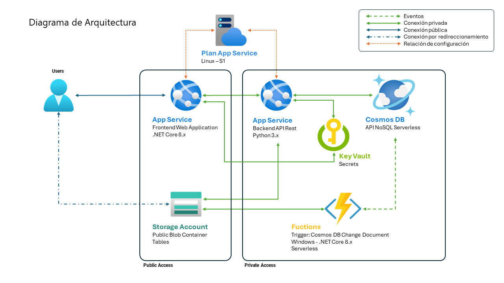

# Solución Stock Smart

## Descripción de la solución

**Stock Smart** es una solución integral diseñada para gestionar las existencias de productos de compañías que comercializan a través de Internet. 

Nuestra plataforma utiliza tecnología de Azure con una interfaz intuitiva para optimizar la gestión de inventarios, garantizando eficiencia, precisión y rentabilidad para su negocio.

## Diagrama de la Arquitectura



## Proyectos

### StockSmart

#### **Proyecto:** Aplicación Web MVC
#### **Lenguaje/Framework:** C# .NET Core 8.x

El controlador **Productos** permite:

- Buscar productos por referencia, descripción y rango de precios
- Insertar nuevos productos
- Modificar productos existentes

La operativa del controlador se realiza a través del API desarrollada en el proyecto *StockSmartAPI*. Para conectar con el API requiere un **API Key** que se envia como cabecera y se encuantra almacenado en *Azure Key Vault*. El *App Service* lee automáticamente la **API Key** del *Key Vault* mediante la configuración de una variable de entorno.


### StockSmartAPI

#### **Proyecto:** API Rest
#### **Lenguaje/Framework:** Python 3.xx con Flask

El proyecto es un API que trabaja con una base de datos Azure CosmosDB. Para conectar con el Cosmos DB requiere una **cadena de conexión** almacenada en *Azure Key Vault*. El *App Service* lee automáticamente la **cadena de conexión** del *Key Vault* mediante la configuración de una variable de entorno.

El acceso al API se realiza mediante un **API Key** enviada como cabecera. Si el **API Key** no es valido o no esta presente se retorna *401 Unauthorized*.

El API admite los siguientes métodos:

   | Request        | Status Code Response       | Body Response        |
   | -------------- | -------------------------- | -------------------- |
   | GET            | 200 OK                     | Data en JSON         |
   | POST           | 201 Create                 | Data en JSON         |
   | PUT            | 204 No Content             |                      |
   
**Definición de producto en JSON**

```javascript
{"ProductID":"","ProductName":"","SupplierID":"","CategoryID":"","QuantityPerUnit":"","UnitPrice":"","UnitsInStock":"","UnitsOnOrder":"","ReorderLevel":"","Discontinued":""}
```

#### GET

- **Endpoint:** https://dominio.com/productos/id/

Retorna el producto coincidente con el **id** del producto o *404 Not Found* si no existe en la base de datos.

- **Endpoint:** https://dominio.com/productos/?desc=""
- **Endpoint:** https://dominio.com/productos/?price="<precio mínimo>-<precio máximo>"
- **Endpoint:** https://dominio.com/productos/?desc=""&price="<precio mínimo>-<precio máximo>"

Retorna una colección de productos. El parámetro **desc** contiene texto para realizar la búsqueda de producto por *ProductName*. El parámetro **price** contiene un texto con un rango de precios para realizar la búsqueda de productos por *UnitPrice*. Los parámetros se pueden combinar en la misma petición.


#### POST

- **Endpoint:** https://dominio.com/productos/

Inserta un nuevo producto en la base datos. El cuerpo del mensaje contiene los datos del nuevo producto en JSON. Cualquier error retornara un *400 Bad Request*.


#### PUT

- **Endpoint:** https://dominio.com/productos/id/

Actualiza el producto coincidente con el **id** del producto. El cuerpo del mensaje contiene los datos del  producto en JSON. Cualquier error retornara un *400 Bad Request*.


### StockSmartFunctions

#### **Proyecto:** Azure Function
#### **Lenguaje/Framework:** C# .NET Core 8.x

Registra en una tabla de una *Cuenta de Almacenamiento* las operaciones de actualización de datos que suceden en Cosmos DB, considerando este registo el LOG de la aplicación API Rest. 

Para conectar con la *Cuenta de Almacenamiento* requiere una **cadena de conexión** almacenada en *Azure Key Vault*. El *Function Service* lee automáticamente la **cadena de conexión** del *Key Vault* mediante la configuración de una variable de entorno.